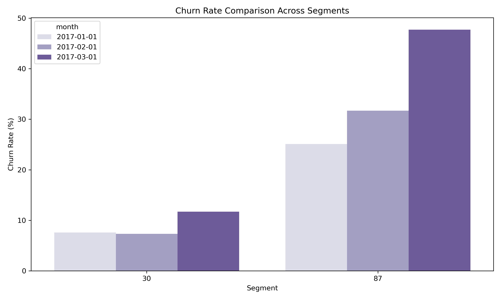

**Overview**

This project involves calculating and visualising churn rates across customer segments for a subscription-based service. We explore the churn rates for different segments over time, clean the data to handle issues such as missing or invalid values, and generate actionable insights to improve customer retention.

**Objective:**

* Calculate churn rates for different customer segments over time (January to March 2017).
* Identify and address data quality issues, such as invalid or missing data points.
* Visualise the results to provide actionable insights for business decision-making.

**Data Cleaning and Issue Resolution**

Problem Identification:

During the initial analysis, several challenges were identified with the data:

1. Importing CSV File: When importing the CSV file into MySQL with the subscription_end column set to the DATE data type, only 620 rows out of 2000 were imported. This was likely caused by empty values for users without a subscription_end date. To resolve this, I changed the column data type to VARCHAR, which allowed all 2000 records to be imported. However, this caused formatting issues related to time data.

2. Time Data Formatting Issues: The subscription_end column, initially set to VARCHAR, contained inconsistent date values due to MySQL automatically inserting 00:00:00 as the time portion when the data type was set to DATE. This issue seemed to arise after switching back to DATE because not all values were valid dates (some had empty spaces for users without a subscription_end). The presence of 00:00:00 caused problems with churn rate calculations as it led to incorrect values. Furthermore, the empty values couldn’t be changed to NULL because of this formatting issue, preventing proper data cleaning.

3. Empty or NULL Values: Some rows in the subscription_end column contained empty strings (representing users who hadn’t cancelled their subscriptions). These needed to be properly handled for accurate churn rate calculations.

**Data Cleaning Steps:**

To address these issues, the following steps were taken:

1. Handling the 00:00:00 Time Issue: Initially, I set both the subscription_start and subscription_end columns to the DATE data type. While the subscription_start column updated successfully, the subscription_end column caused issues due to empty values. MySQL inserted 00:00:00 for these, making it difficult to clean the data. I tried various methods, such as updating the column using DATE(), STR_TO_DATE(), TRIM(), CAST(), and SUBSTRING(), but none fully resolved the issue.

The solution involved reloading the data with subscription_end set to VARCHAR, which allowed all 2000 records to be imported. I then ran queries to identify invalid date formats in the subscription_end column, which revealed that empty values were causing MySQL to fail at processing them as valid dates.

2. Handling Missing Values: To resolve this, I replaced the empty strings with NULL by temporarily disabling safe mode to ensure I could update the column. This ensured consistency within the column:

sql:

UPDATE subscriptions
SET subscription_end = NULL
WHERE subscription_end = '';  -- Empty strings are set to NULL

SET SQL_SAFE_UPDATES = 0;

This step resolved the time conflict, as the 00:00:00 time portion was no longer included in the subscription_end column values, allowing the data to be cleaned properly without worrying about inconsistent date formats.

After addressing the 00:00:00 issue, I ensured that the subscription_end column could handle NULL values, representing subscriptions that had not yet ended. This allowed active subscriptions to be processed correctly in the churn rate calculations.

3. Ensuring Data Integrity: After cleaning the data, I conducted a final check to ensure there were no invalid entries and that all rows were consistent. This step was crucial to ensure the accuracy of the churn rate calculations.

4. Final Data Check: After making the necessary updates, I confirmed that the subscription_end column was free of invalid entries and appropriately represented NULL values for users without an end date. This ensured that the data was now ready for analysis.

**Churn Rate Calculation and Insights**

Churn Rate Formula:

The churn rate was calculated for each segment by comparing the number of cancelled subscriptions to the total active subscriptions within each month. The formula used was:

Churn Rate = (Cancelled Subscriptions/Active Subscriptions)×100

**Segments Analysed:**
* Segment 30: A lower churn rate was observed in this segment, suggesting better retention or satisfaction with the service.
* Segment 87: A higher churn rate indicated potential dissatisfaction or a need for additional customer retention strategies.

**Key Insights:**

1. Churn by Segment:

* Segment 87 exhibited a higher churn rate compared to Segment 30. This suggests that customers in Segment 87 might need additional engagement strategies to improve retention.
* Segment 30 had a relatively low churn rate, which may indicate strong customer satisfaction or loyalty. The company might want to explore what drives loyalty in this segment and apply similar strategies to other segments.

2. Time-Based Trends:

* The churn rate increased in March, which might indicate a seasonal trend or other factors such as a lack of incentives to renew subscriptions. This provides an opportunity to introduce targeted campaigns to reduce churn during this period.

**Visualisations:**

1. Churn Rate by Segment Over Time

This bar chart shows the churn rate for each segment across the months from January to March. Segment 30 consistently shows a lower churn rate compared to Segment 87, emphasising the need for tailored retention strategies.

2. Churn Rate Comparison Across Segments

This visualisation compares the churn rate between segments, providing insights into which segment is performing better in terms of retention.

**Recommendations:**

1. Targeted Retention Strategies for Segment 87: Given the higher churn rate in Segment 87, it would be beneficial to implement retention campaigns such as personalised emails, promotions, or exclusive content to keep these customers engaged.

2. Seasonal Retention Campaigns: Since churn increases in March, the company should consider offering special promotions or loyalty incentives to retain customers during this period.

3. Replicate Successful Strategies from Segment 30: Analyse what makes Segment 30 more loyal and apply similar tactics to other segments to improve retention.

**Conclusion**

This project demonstrates a comprehensive analysis of churn rates, addressing data quality issues and generating actionable insights. By cleaning the data, calculating churn rates for different segments, and visualising the results, we gained valuable insights into customer behaviour and potential strategies for improving retention.

**What I Learned:**

* The importance of cleaning data to ensure accurate analysis.
* The ability to calculate meaningful metrics (like churn rate) and translate them into actionable business insights.
* Experience with using SQL, Python, and visualisation tools to perform data analysis and present results effectively.

**Embedding Visuals**

The visualisations were created using Python's Seaborn and Matplotlib libraries to provide insights into the churn rates across segments and over time. The following images were saved and included for easy reference:

Churn Rate by Segment Over Time: Shows how the churn rate varies for different segments across months.
Churn Rate Comparison Across Segments: Highlights the difference in churn rates between segments for each month.
You can view these visualisations in the images below, which are embedded directly into the README.

